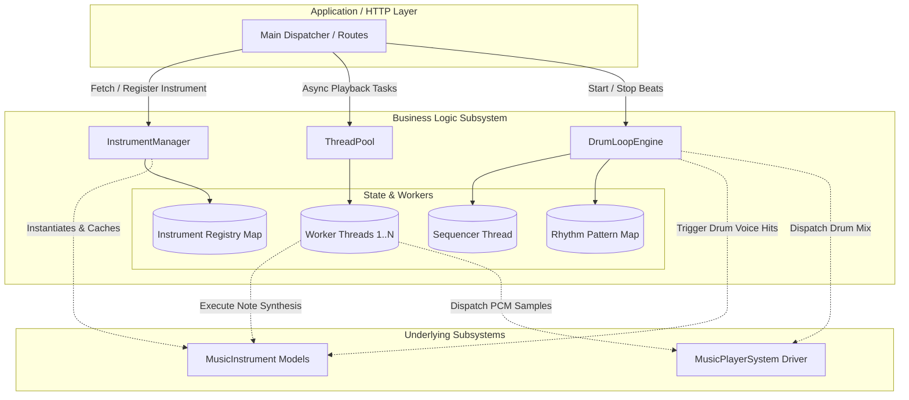
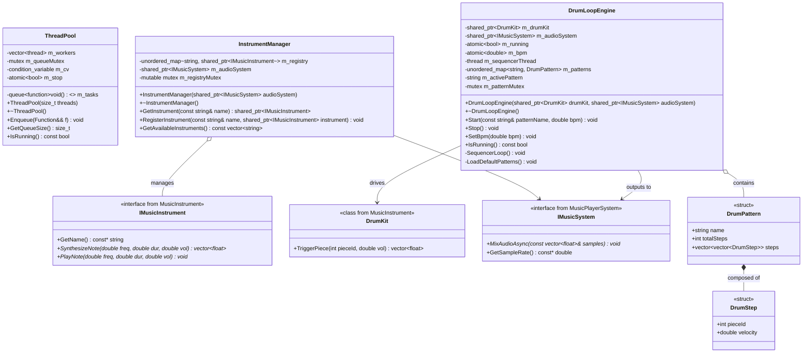
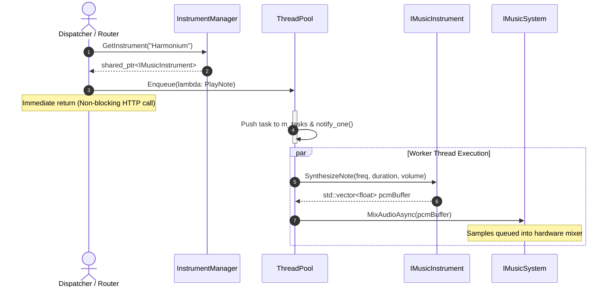
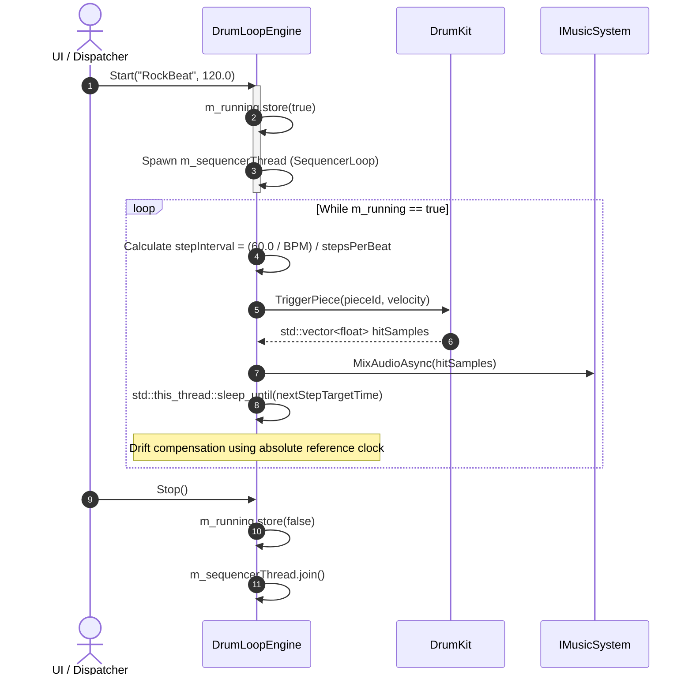

# Low-Level Design (LLD): MusicBuilderBL

The `MusicBuilderBL` (Music Builder Business Logic) library serves as the core orchestration, domain scheduling, and resource abstraction engine for the Synthesizer Workstation. It bridges high-level HTTP client triggers with physical instrument DSP modeling and low-level hardware playback drivers.

---

## 1. Component Architecture

The module decouples task execution, instrument lifecycle management, and metric rhythm sequencing across three primary boundaries:



---

## 2. Class Responsibility & Collaborations

* **`ThreadPool`**:
* **Role**: Generic, thread-safe asynchronous task execution pool using modern C++ condition variables and task queues.
* **Responsibilities**: Manages worker thread lifecycle; schedules non-blocking note rendering; bounds CPU concurrency to prevent context-switching thrashing during polyphonic bursts.


* **`InstrumentManager`**:
* **Role**: Central factory and registry cache for melodic sound generators (`IMusicInstrument`).
* **Responsibilities**: Thread-safe lazy initialization and lookup of instrument models (e.g., Harmonium, Grand Piano, Kalimba, Acoustic Guitar, Saxophone, Violin, Trumpet); enforces lifecycle scope via `std::shared_ptr`.


* **`DrumLoopEngine`**:
* **Role**: Real-time tempo clock and rhythm pattern sequencer.
* **Responsibilities**: Executes step-based loops (Rock, Funk, Metronome/Teental); handles tempo dynamic rescaling ($BPM \to \text{Step Duration}$); maintains drift-free sequence cadence on a dedicated scheduling thread.


---

## 3. Low-Level Class Diagram



---

## 4. Sequence Diagrams

### Melodic Note Asynchronous Execution Flow



---

### Rhythm Sequencer Loop Execution Flow



---

## 5. Concurrency & Thread Synchronization Model

```mermaid
stateDiagram-v2
    [*] --> Idle

    state ThreadPoolConcurrency {
        [*] --> QueueEmpty
        QueueEmpty --> QueueOccupied : Enqueue(task) acquires m_queueMutex
        QueueOccupied --> TaskPopped : Worker wakes via m_cv condition
        TaskPopped --> Processing : Lock released; invoke task()
        Processing --> QueueEmpty : Task completed
    }

    state SequencerConcurrency {
        [*] --> SequencerStopped
        SequencerStopped --> SequencerRunning : Start() spawns std::thread
        SequencerRunning --> StepTrigger : Sleep cycle expires
        StepTrigger --> MixAsyncDispatched : Audio driver mutex locked briefly
        MixAsyncDispatched --> SequencerRunning : Re-arm next absolute tick
        SequencerRunning --> SequencerStopped : Stop() sets m_running=false & join()
    }

```

### Thread Safety Guarantees

* **`ThreadPool` Worker Synchronization**: Tasks are guarded by `std::unique_lock<std::mutex>`. Idle threads block on `std::condition_variable::wait` to consume negligible CPU cycles while awaiting work.
* **`InstrumentManager` Concurrency**: Instrument retrieval is thread-safe. Registry map reads and insertions are protected by `m_registryMutex`, preventing race conditions during dynamic registration.
* **Clock Isolation**: The rhythm loop executes on an isolated thread, preventing UI processing delays or heavy note synthesis jobs from jittering the drum tempo.

---

## 6. Applied Design Patterns

* **Thread Pool Pattern (`ThreadPool`)**: Decouples request dispatch from audio computation, preventing thread exhaustion under rapid polyphonic keyboard input.
* **Registry & Flyweight Pattern (`InstrumentManager`)**: Caches and shares single instrument instances across requests, minimizing allocations and model recreation.
* **Strategy Pattern (`IMusicInstrument`)**: Provides interchangeable audio synthesis algorithms (reeds, plucked strings, acoustic physical models) via a unified interface.
* **Command Pattern (`std::function<void()>` inside `ThreadPool`)**: Encapsulates audio rendering requests as executable closures passed seamlessly across threads.

---

## 7. Known Issues & Limitations

* **Timer Jitter on Sleep Intervals**: Standard OS schedulers (`std::this_thread::sleep_until`) on non-RTOS platforms (Windows/Linux) can incur up to $\pm 1 \text{ ms}$ to $15 \text{ ms}$ of scheduling jitter depending on thread quantum settings.
* **Unbounded Memory Queue Under Saturation**: If requests are dispatched faster than CPU cores can synthesize PCM samples, the queue (`std::queue<std::function<void()>>`) will grow without bound, risking memory pressure.
* **Lack of Voice Stealing**: Rapid triggering of polyphonic notes produces overlapping active voices; excessive active voices may degrade performance before decaying naturally.

---

## 8. Improvement Scopes

* **Bounded Queue with Drop / Voice-Stealing Policy**: Enforce a maximum capacity in `ThreadPool`. If the threshold is reached, automatically cull the oldest voice or downsample releases to maintain real-time responsiveness.
* **High-Resolution Multimedia Timers**: Upgrade `DrumLoopEngine` on Windows to use `timeSetEvent` or waitable multimedia timers (`CreateWaitableTimerEx`) for sub-millisecond precision rhythm tracking.
* **Lock-Free Single-Producer Single-Consumer (SPSC) Ring Buffers**: Replace internal mutex-protected task queues with lock-free atomic queues (`boost::lockfree::queue` or custom ring buffers) to eliminate lock contention on audio paths.
* **Dynamic Sample-Rate Propagation**: Add an event hook to automatically refresh synthesis lookup tables whenever the system sample rate changes in the underlying audio engine.