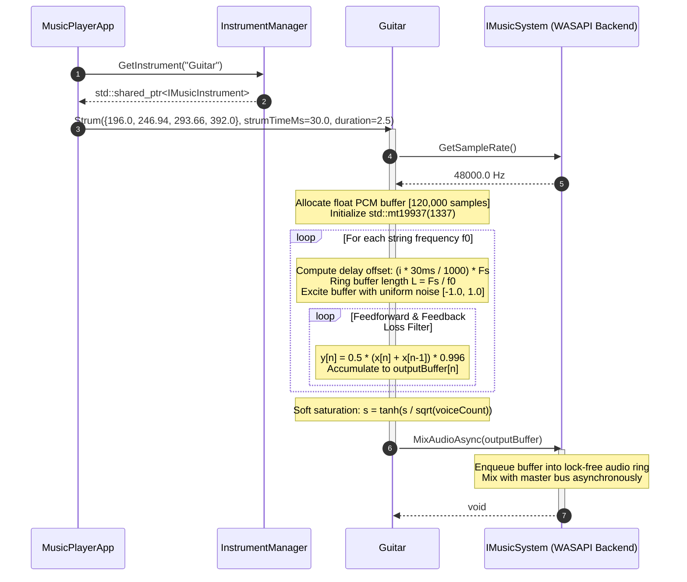
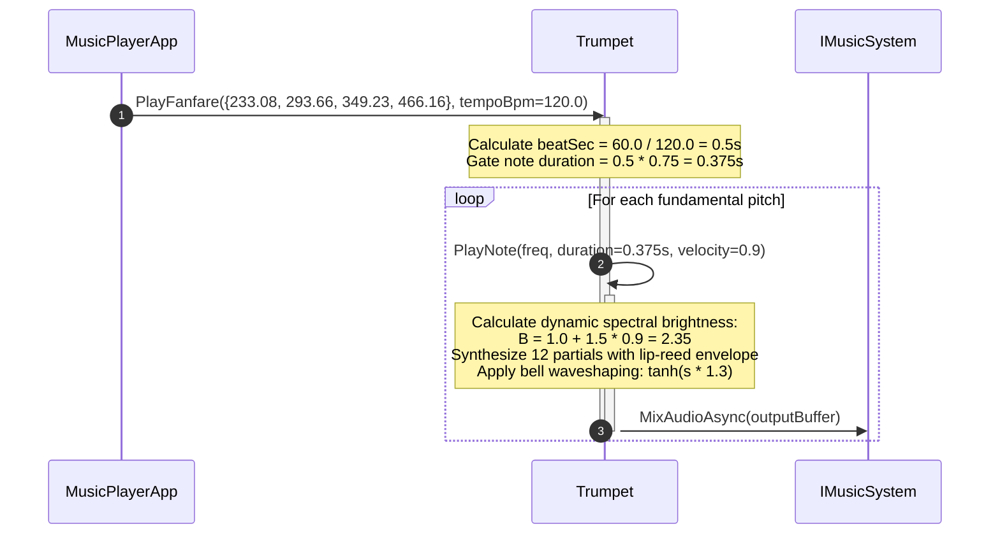

# Low-Level Design (LLD): MusicInstrument Module

**Author**: Soumyajit Chattopadhyay

**Date**: 03-Sep-2026

**Status**: Approved / Under Implementation

**Target Target DLL**: `MusicInstrument.dll` (`MI_API`)

---

## 1. System Architecture & Module Boundaries

The `MusicInstrument` library is an object-oriented, physical-modeling synthesis engine designed to decouple acoustic modeling from audio driver playback. It provides polyphonic, multi-timbral synthesis capabilities spanning plucked strings, bowed strings, aerophones, free-reed instruments, struck membranes, and percussive lamellophones.

### Architectural Context

```
┌─────────────────────────────────────────────────────────────┐
│                      MusicPlayerApp                         │
└──────────────────────────────┬──────────────────────────────┘
                               │
┌──────────────────────────────▼──────────────────────────────┐
│                      MusicBuilderBL                         │
│               (InstrumentManager, ThreadPool)               │
└──────────────────────────────┬──────────────────────────────┘
                               │
┌──────────────────────────────▼──────────────────────────────┐
│                      MusicInstrument                        │
│   (IMusicInstrument, IStringInstrument, IWindInstrument...)  │
└──────────────────────────────┬──────────────────────────────┘
                               │ (MixAudioAsync / RenderAudio)
┌──────────────────────────────▼──────────────────────────────┐
│                     MusicPlayerSystem                       │
│      (IMusicSystem, WindowsMusicSystem, WASAPI Mixer)       │
└─────────────────────────────────────────────────────────────┘

```

* **MusicPlayerSystem**: Exposes `IMusicSystem`, providing sample rate configuration ($F_s$) and hardware/driver mixing (`MixAudioAsync`, `RenderAudio`).
* **MusicInstrument**: Encapsulates mathematical modeling, dynamic range compression (tanh saturation), circular waveguide lines, and harmonic additive engines.
* **MusicBuilderBL**: Manages instrument lifecycles through `InstrumentManager`, exposing thread-safe abstractions to client-side UI applications.

---

## 2. Class Design & Hierarchy

The module is architected around interface segregation:

* **`IMusicInstrument`**: Root interface defining pitch generation contracts (`PlayNote`, `PlayChord`, `GetName`).
* **`IStringInstrument`**: Extends pitch generation with string-centric actions (`PluckString`, `Strum`, `GetStringCount`).
* **`IWindInstrument`**: Extends pitch generation with column excitation dynamics (`SetMute`, `Tonguing`).
* **`IPercussionInstrument`**: Interface handling polyphonic rhythm units, drum heads, and metallic hit articulation.

### Class Diagram

```mermaid
classDiagram
    class IMusicInstrument {
        <<interface>>
        +~IMusicInstrument()*
        +GetName() string*
        +PlayNote(double frequencyHz, double durationSeconds, double velocity) void*
        +PlayChord(vector~double~ frequencies, double durationSeconds, double velocity) void*
    }

    class IStringInstrument {
        <<interface>>
        +~IStringInstrument()*
        +GetStringCount() int*
        +PluckString(int stringIndex, double durationSeconds, double velocity) void*
        +Strum(vector~double~ chordFrequencies, double strumTimeMs, double durationSeconds) void*
    }

    class IWindInstrument {
        <<interface>>
        +~IWindInstrument()*
        +SetMute(BrassMuteType mute) void*
        +Tonguing(double frequencyHz, int noteCount, double noteDuration, double velocity) void*
    }

    class IPercussionInstrument {
        <<interface>>
        +~IPercussionInstrument()*
        +GetDrumPieces() vector~string~*
        +HitDrum(DrumPiece piece, double velocity, double durationSeconds) void*
        +PlayBeat(vector~DrumPiece~ pieces, double durationSeconds, double velocity) void*
    }

    class IMusicSystem {
        <<interface>>
        +GetSampleRate() double*
        +MixAudioAsync(vector~float~ buffer) void*
        +RenderAudio(vector~float~ buffer) void*
    }

    class BassGuitar {
        -shared_ptr~IMusicSystem~ m_musicSystem
        -string m_name
        -vector~double~ m_openTuning
        +GetName() string
        +PlayNote(...) void
        +PlayChord(...) void
        +GetStringCount() int
        +PluckString(...) void
        +Strum(...) void
    }

    class Guitar {
        -shared_ptr~IMusicSystem~ m_musicSystem
        -string m_name
        -vector~double~ m_openTuning
        +GetName() string
        +PlayNote(...) void
        +PlayChord(...) void
        +GetStringCount() int
        +PluckString(...) void
        +Strum(...) void
    }

    class Mandolin {
        -shared_ptr~IMusicSystem~ m_musicSystem
        -string m_name
        -vector~double~ m_courseTunings
        +GetName() string
        +PlayNote(...) void
        +PlayChord(...) void
        +GetStringCount() int
        +PluckString(...) void
        +Strum(...) void
        +PlayTremolo(...) void
    }

    class Violin {
        -shared_ptr~IMusicSystem~ m_musicSystem
        -string m_name
        -vector~double~ m_openTuning
        +GetName() string
        +PlayNote(...) void
        +PlayChord(...) void
        +GetStringCount() int
        +PluckString(...) void
        +Strum(...) void
        +BowString(...) void
    }

    class Saxophone {
        -shared_ptr~IMusicSystem~ m_system
        -string m_name
        -BrassMuteType m_currentMute
        +GetName() string
        +PlayNote(...) void
        +PlayChord(...) void
        +SetMute(BrassMuteType mute) void
        +Tonguing(...) void
    }

    class Trumpet {
        -shared_ptr~IMusicSystem~ m_musicSystem
        -string m_name
        -BrassMuteType m_mute
        +GetName() string
        +PlayNote(...) void
        +PlayChord(...) void
        +SetMute(BrassMuteType mute) void
        +Tonguing(...) void
        +PlayFanfare(...) void
    }

    class DrumKit {
        -shared_ptr~IMusicSystem~ m_musicSystem
        -string m_name
        +GetName() string
        +PlayNote(...) void
        +PlayChord(...) void
        +GetDrumPieces() vector~string~
        +HitDrum(...) void
        +PlayBeat(...) void
        -SynthesizePiece(...) void
    }

    class Piano {
        -shared_ptr~IMusicSystem~ m_musicSystem
        -string m_name
        +GetName() string
        +PlayNote(...) void
        +PlayChord(...) void
    }

    class Harmonium {
        -shared_ptr~IMusicSystem~ m_musicSystem
        -string m_name
        -bool m_couplerEnabled
        +GetName() string
        +SetCoupler(bool enabled) void
        +PlayNote(...) void
        +PlayChord(...) void
        +PlayDrone(...) void
    }

    class Kalimba {
        -shared_ptr~IMusicSystem~ m_musicSystem
        -string m_name
        +GetName() string
        +PlayNote(...) void
        +PlayChord(...) void
    }

    IMusicInstrument <|-- BassGuitar
    IStringInstrument <|-- BassGuitar

    IMusicInstrument <|-- Guitar
    IStringInstrument <|-- Guitar

    IMusicInstrument <|-- Mandolin
    IStringInstrument <|-- Mandolin

    IMusicInstrument <|-- Violin
    IStringInstrument <|-- Violin

    IMusicInstrument <|-- Saxophone
    IWindInstrument <|-- Saxophone

    IMusicInstrument <|-- Trumpet
    IWindInstrument <|-- Trumpet

    IMusicInstrument <|-- DrumKit
    IPercussionInstrument <|-- DrumKit

    IMusicInstrument <|-- Piano
    IMusicInstrument <|-- Harmonium
    IMusicInstrument <|-- Kalimba

    BassGuitar ..> IMusicSystem : uses
    Guitar ..> IMusicSystem : uses
    Mandolin ..> IMusicSystem : uses
    Violin ..> IMusicSystem : uses
    Saxophone ..> IMusicSystem : uses
    Trumpet ..> IMusicSystem : uses
    DrumKit ..> IMusicSystem : uses
    Piano ..> IMusicSystem : uses
    Harmonium ..> IMusicSystem : uses
    Kalimba ..> IMusicSystem : uses

```



---

## 3. Sequence Diagrams & Execution Flow

### 3.1 Polyphonic Plucked String Execution (`Guitar::Strum`)



### 3.2 Articulated Brass Fanfare (`Trumpet::PlayFanfare`)



---

## 4. Physical Modeling & Acoustic Physics Details

The module relies on time-domain physical modeling and additive modal synthesis to emulate acoustic properties without relying on static sample tables.

### 4.1 Digital Waveguide Karplus-Strong Synthesis (Plucked Strings)

Applied in `Guitar`, `BassGuitar`, `Mandolin`, and `Violin (Pizzicato)`:

* **Fundamental Equation**:

$$L = \left\lfloor \frac{F_s}{f_0} \right\rfloor$$


Where $F_s$ is the system sampling frequency and $f_0$ is the target pitch frequency.
* **Loss Filter**:

$$y[n] = \rho \cdot \frac{x[n] + x[n-1]}{2}$$


Where $\rho$ is the frequency-dependent attenuation coefficient:
* `BassGuitar`: $\rho = 0.998$ (Low internal damping, thick wound nickel/steel core).
* `Guitar`: $\rho = 0.996$ (Steel string sustain).
* `Mandolin`: $\rho = 0.991$ (Short string length, higher bridge downward force).
* `Violin (Pizz)`: $\rho = 0.985$ (Rapid damping against human fingertip).


* **Low-Pass Noise Pre-filtering**:
To prevent unnatural metallic transients on bass strings, excitation noise $w[n]$ is smoothed before entering the delay line:

$$x[0..L] = 0.6 \cdot w[k] + 0.4 \cdot w[k-1]$$


### 4.2 Stiff Beam Modal Inharmonicity (Grand Piano & Kalimba)

* **Piano Inharmonic Dispersion**:
Because piano strings have significant bending stiffness, restoring forces exceed pure tension at high modal numbers, stretching overtones sharp:

$$f_k = k \cdot f_0 \cdot \sqrt{1 + B \cdot k^2}, \quad B = 0.00015$$


*Coupled Unison Double Decay*: Bridge impedance splits string motion into parallel (fast decaying, high acoustic projection) and anti-phase (slow decaying, prolonged sustain) modes:

$$A(t) = 0.7 \cdot e^{-\alpha_{\text{fast}} \cdot t} + 0.3 \cdot e^{-\alpha_{\text{slow}} \cdot t}$$


* **Kalimba (Clamped Cantilever Lamella)**:
A metal tine clamped at one end and free at the other follows the Euler-Bernoulli beam equation, creating non-integer flexural modes:

$$f_1 \approx 5.4 \cdot f_0$$


The fundamental sustains ($e^{-2.5t}$) while the inharmonic strike overtone damps rapidly ($e^{-12.0t}$).

### 4.3 Free-Reed Aero-Acoustics & Cavity Formants (Harmonium)

* **Odd/Even Harmonic Spectral Profile**:
The harmonium reed slices air symmetrically, generating odd-dominated harmonics decaying according to:

$$A_k = \frac{1}{k^{0.85}} \cdot \begin{cases} 1.0 & k \text{ is odd} \\ 0.65 & k \text{ is even} \end{cases}$$


* **Acoustic Body Formants**:
Dual resonance peaks simulate the wooden resonance box:

$$H(f) = 1.0 + 0.5 \cdot \exp\left(-\left(\frac{f - 800}{300}\right)^2\right) + 0.3 \cdot \exp\left(-\left(\frac{f - 2200}{500}\right)^2\right)$$


* **Bellows Pumping Modulation**:
Simulates manual air reservoir pulsing via a low-frequency oscillator:

$$P_{\text{bellows}}(t) = 1.0 + 0.04 \cdot \sin(2\pi \cdot 4.5 \cdot t)$$


### 4.4 Lip-Reed & Single-Reed Aerophones (Trumpet & Saxophone)

* **Saxophone**: Conical air column behaving as an open pipe, supporting all integer harmonics ($k = 1, 2, 3, 4, 5$). Breath pressure transitions use a trapezoidal envelope ($50\text{ ms}$ attack, $80\text{ ms}$ release).
* **Trumpet**: Lip-reed excitation where blowing pressure non-linearly increases high-frequency spectral energy:

$$A_k = k^{-\frac{1.2}{1.0 + 1.5 \cdot \text{velocity}}}$$


*Mute Modifications*:
* *Straight*: High-pass boost ($A_{k \ge 4} \times 1.5$).
* *Harmon*: Resonant bandpass boost simulating the stem cavity ($A_{3 \le k \le 6} \times 2.2$).


### 4.5 Membrane & Shell Percussion (DrumKit)

* **Kick Drum**: Time-varying pitch drop combined with high-frequency transient beater click:

$$f(t) = 45.0 + 105.0 \cdot e^{-40t}, \quad t_{\text{click}} < 5\text{ ms}$$


* **Snare Drum**: Coupled 2-component system comprising low-frequency shell resonance ($180\text{ Hz} \cdot e^{-15t}$) and high-frequency wire rattle ($w(t) \cdot e^{-20t}$).

---

## 5. Supported Instruments Summary

| Instrument | Acoustic Category | Synthesis Algorithm | Physics Highlights | Primary Output Dispatch |
| --- | --- | --- | --- | --- |
| **BassGuitar** | Plucked String | Karplus-Strong Waveguide | Pre-filtered low-pass noise, $\rho=0.998$, heavy gauge simulation | `MixAudioAsync` |
| **Guitar** | Plucked String | Karplus-Strong Waveguide | Uniform noise, $\rho=0.996$, staggered temporal strum offsets | `MixAudioAsync` |
| **Mandolin** | Plucked String | Dual-Line Karplus-Strong | Paired courses with micro-detuning ($\pm 0.35\text{ Hz}$), tremolo loop | `MixAudioAsync` / `RenderAudio` |
| **Violin** | Bowed / Plucked String | Additive / Karplus-Strong | Helmholtz sawtooth series, 2.5 kHz bridge formant, delayed vibrato | `MixAudioAsync` / `RenderAudio` |
| **Piano** | Struck String | Additive Modal Matrix | String stiffness dispersion ($B=0.00015$), double-exponential decay | `MixAudioAsync` |
| **Harmonium** | Free-Reed Aerophone | Additive Reed Banks | Dual reed micro-detuning, bellows tremor ($4.5\text{ Hz}$), octave coupler | `MixAudioAsync` |
| **Kalimba** | Lamellophone | Modal Beam Synthesis | Transversal mode overtone ($5.4 \cdot f_0$), fast transient attack ($2\text{ ms}$) | `MixAudioAsync` |
| **Trumpet** | Lip-Reed Brass | Non-linear Additive | Dynamic harmonic brightness, Harmon/Straight acoustic mute filtering | `MixAudioAsync` |
| **Saxophone** | Single-Reed Conical | Integer Additive Series | Open conical-pipe harmonics, staccato tonguing articulation | `MixAudioAsync` |
| **DrumKit** | Membrane / Percussion | Parametric Non-Linear | Exponential pitch sweeps, beater transient, metallic noise wash | `MixAudioAsync` |

---

## 6. Concurrency & Threading Model

The `MusicInstrument` library operates under a decoupled multi-tier threading model:

```
[UI / Client Thread]
        │  Method calls (PlayNote, PlayChord, Strum)
        ▼
[Worker Thread / ThreadPool]
        │
        ├── Allocates local std::vector<float> outputBuffer
        ├── Runs compute-heavy DSP loop (Karplus-Strong, Additive Sine Banks)
        ├── Applies local dynamic saturation: std::tanh(...)
        │
        ▼  Hands off completed buffer
[IMusicSystem Interface]
        │  MixAudioAsync(outputBuffer)
        ▼
[Audio Mixing Pipeline (WindowsMusicSystem)]
        │  Pushes to concurrent lock-free queue
        ▼
[High-Priority WASAPI Audio Engine Thread]
        │  Pulls mixed buffers and renders to hardware endpoint

```

### Thread Safety Principles

* **Stateless Audio Synthesis**: All mathematical rendering buffers are allocated on the stack or as local vector instances within the calling method. No shared mutable waveform buffers exist across class instances.
* **Non-Blocking Dispatch**: Audio buffers are handed over to `m_musicSystem->MixAudioAsync()` via move-semantics or const-reference copying, allowing the instrument method to return without blocking the calling thread.
* **Deterministic Pseudo-Random Generation**: Classes using random excitation (`Guitar`, `DrumKit`, `Mandolin`, `Violin`) instantiate local `std::mt19937` engines seeded with static constants (e.g., `4242`, `1337`, `999`). This guarantees deterministic rendering across concurrent threads without relying on global locking primitives.

---

## 7. Known Issues & Scope for Improvement

### Known Architectural Limitations

* **Blocking Thread Sleep in Articulations**:
`Saxophone::Tonguing` and `Trumpet::Tonguing` currently rely on `std::this_thread::sleep_for(...)` across loop iterations. While functional for simple test harness playback, invoking tonguing directly from the UI or primary event dispatch thread causes timing jitter and UI freezes.
* **Deterministic Seed Phase Repetition**:
Because random number engines use fixed seeds on every note strike, fast repeated plucks on identical notes produce identical noise bursts, causing an unnatural mechanical sound.
* **Fixed Sample Rate Fallbacks**:
If the `IMusicSystem` dependency is initialized late or fails to return a valid sample rate, several routines assume a fallback of $48000.0\text{ Hz}$, which can introduce pitch-drift if operating on $44100\text{ Hz}$ or $96000\text{ Hz}$ endpoints.

### Improvement Roadmap

* **Decoupled Event Scheduling**: Refactor `Tonguing` and `PlayFanfare` into timeline event queues processed inside `MusicBuilderBL` instead of thread-sleeping within `MusicInstrument.dll`.
* **Dynamic White-Noise Phase Dithering**: Introduce thread-local seed variation or uniform phase jitter to avoid static phase replication on rapid strokes.
* **Pure Waveguide Delay Fractioning**: Implement fractional delay interpolation (all-pass filtering) inside Karplus-Strong loops to achieve exact tuning for high-frequency notes where $F_s / f_0$ produces rounding truncation errors.
* **SIMD Vectorization**: Vectorize additive harmonic synthesis loops using AVX2/NEON intrinsics to accelerate multi-voice harmonium, piano, and brass chords.