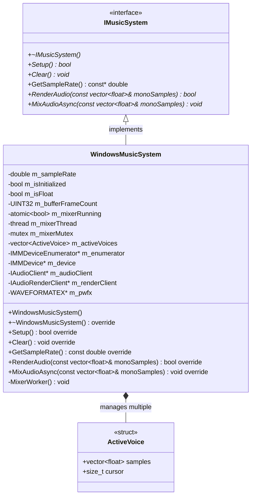
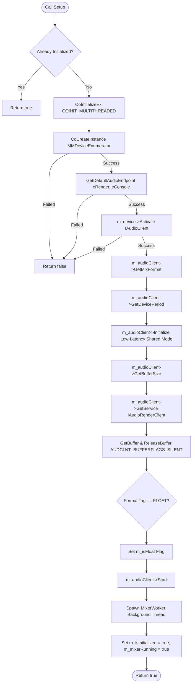
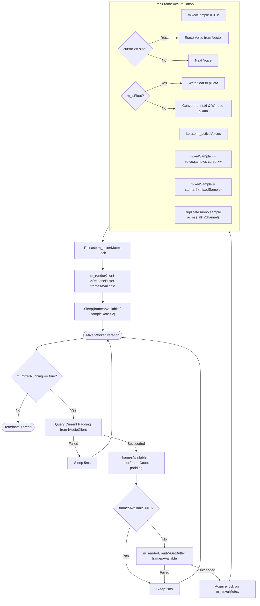
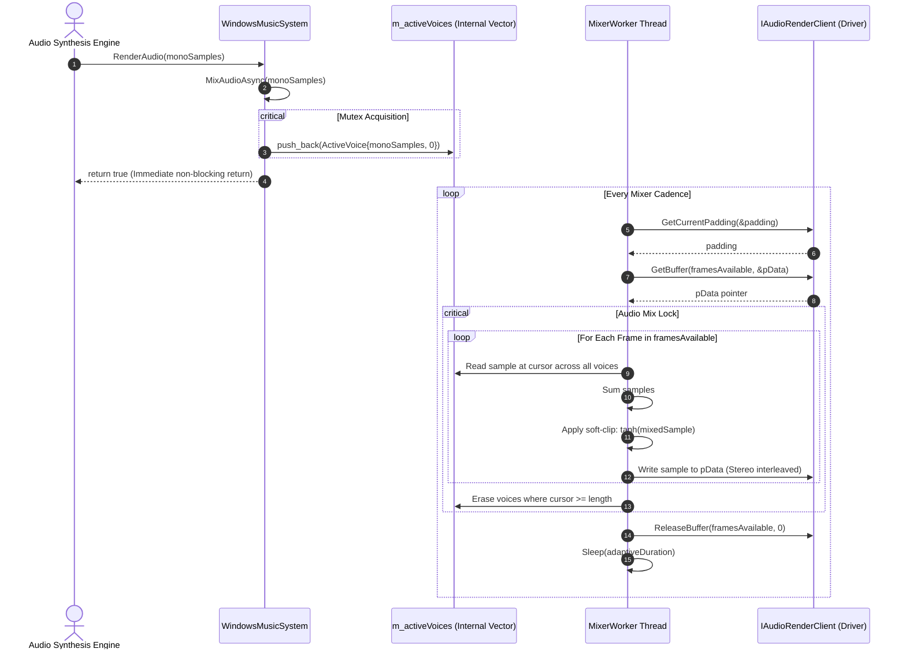

# Low-Level Design (LLD): MusicPlayerSystem

The `MusicPlayerSystem` library is the hardware audio driver abstraction layer for the Synthesizer Workstation. It manages operating system multimedia endpoints, COM threading contexts, native sample rate negotiations, real-time polyphonic software mixing, soft-saturation dynamics, and continuous low-latency streaming to the audio device.

---

## 1. Architectural Overview & Component Responsibilities

The module abstracts hardware platform differences behind a pure virtual interface (`IMusicSystem`), enabling seamless swapping between Windows Core Audio (WASAPI) and Linux ALSA/PulseAudio backends.

* **`IMusicSystem`**: Pure abstract interface defining lifecycle operations (`Setup`, `Clear`), format interrogation (`GetSampleRate`), and audio rendering dispatch (`RenderAudio`, `MixAudioAsync`).
* **`WindowsMusicSystem`**: Production implementation of `IMusicSystem` for Microsoft Windows using the low-latency shared-mode Windows Audio Session API (WASAPI).
* **`ActiveVoice`**: Internal track container maintaining an independent sample buffer vector and a playback read cursor for each active note or percussion hit.
* **`MusicPlayerSystemExport.h`**: Preprocessor macro definitions managing symbol visibility (`__declspec(dllexport)` / `__declspec(dllimport)`) for building the module as a shared or static library.

---

## 2. Low-Level Class Diagram



---

## 3. Data Structures & Field Definitions

### `ActiveVoice`

```cpp
struct ActiveVoice {
    std::vector<float> samples; ///< Normalized IEEE float PCM samples [-1.0, 1.0].
    size_t cursor;              ///< Current frame index offset within the stream.
};

```

### `WindowsMusicSystem` Members

| Member Variable | Type | Visibility | Role & Constraints |
| --- | --- | --- | --- |
| `m_sampleRate` | `double` | Private | Negotiated hardware sampling rate (e.g., 44100.0 or 48000.0 Hz). |
| `m_isInitialized` | `bool` | Private | Tracks setup state; prevents double initialization. |
| `m_isFloat` | `bool` | Private | Flag indicating if endpoint requires IEEE float or 16-bit signed PCM. |
| `m_bufferFrameCount` | `UINT32` | Private | Hardware cyclic buffer capacity in frames. |
| `m_mixerRunning` | `std::atomic<bool>` | Private | Thread control flag for `MixerWorker` lifecycle. |
| `m_mixerThread` | `std::thread` | Private | Dedicated background worker streaming to WASAPI. |
| `m_mixerMutex` | `std::mutex` | Private | Protects `m_activeVoices` list during enqueue and mixer iterations. |
| `m_activeVoices` | `std::vector<ActiveVoice>` | Private | List of polyphonic voices currently playing. |
| `m_enumerator` | `IMMDeviceEnumerator*` | Private | COM endpoint enumeration interface. |
| `m_device` | `IMMDevice*` | Private | Active audio render device. |
| `m_audioClient` | `IAudioClient*` | Private | WASAPI stream control interface. |
| `m_renderClient` | `IAudioRenderClient*` | Private | WASAPI buffer access interface. |
| `m_pwfx` | `WAVEFORMATEX*` | Private | Device mix format structure allocated by COM. |

---

## 4. Operational Flowcharts

### A. Initialization & Device Setup Flow



---

### B. Real-Time Mixer Thread Responsibility Flow

The mixer worker loop executes on a dedicated thread, dynamically feeding the cyclic hardware ring buffer.



---

## 5. Sequence Diagram: Note Dispatch to Audio Hardware Output



---

## 6. Design Constraints & Engineering Decisions

1. **Soft-Saturation Dynamic Limiter (`std::tanh`)**:
When multiple instruments, sustained harmonium reeds, and percussion hits overlap, simple linear summing can exceed the $[-1.0, 1.0]$ amplitude boundary. Instead of harsh hard-clipping which produces high-frequency odd-harmonic distortion, `std::tanh` smoothly compresses peaks while preserving linear fidelity at low-to-medium amplitudes.
2. **Lock-Held Frame Slices**:
The `m_mixerMutex` is held throughout the inner frame loop of each hardware slice. This prevents voice list mutation mid-buffer, eliminates voice tearing, and maintains absolute phase coherence across stereo channels.
3. **Adaptive Cadence Sleep**:
Rather than pinning a CPU core in a spin-wait loop, the mixer thread queries hardware buffer padding and calculates sleep duration as approximately half of the buffer duration:

$$\Delta t = \frac{\text{framesAvailable}}{\text{m\_sampleRate} \times 2.0}$$


This preserves real-time response while keeping background CPU utilization below 1%.
4. **Silence Buffer Priming**:
Before starting the audio clock, WASAPI's buffer is explicitly filled with silence using the `AUDCLNT_BUFFERFLAGS_SILENT` flag to prevent audio pops caused by uninitialized memory.