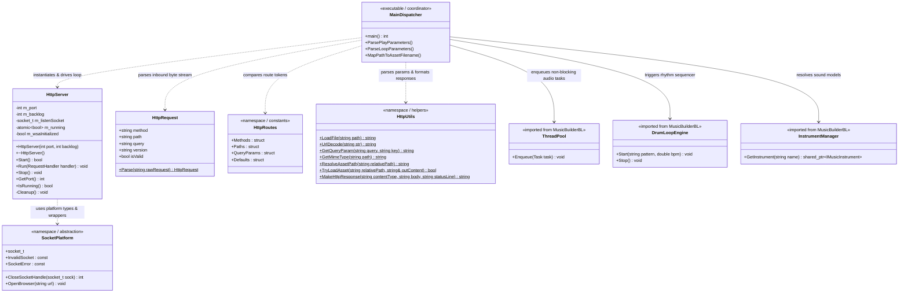
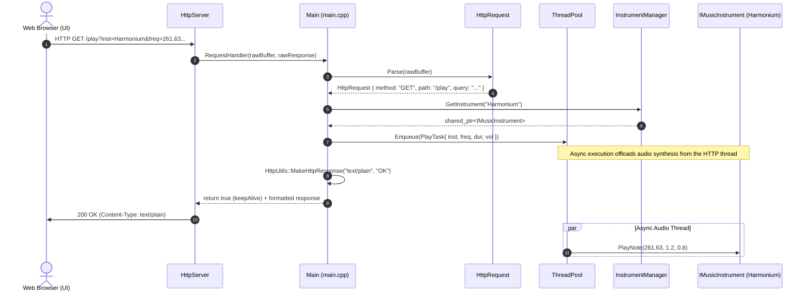
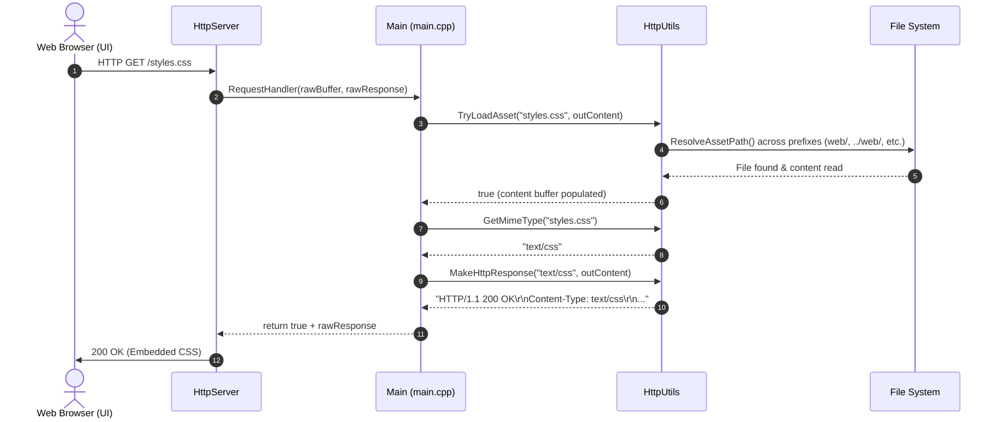
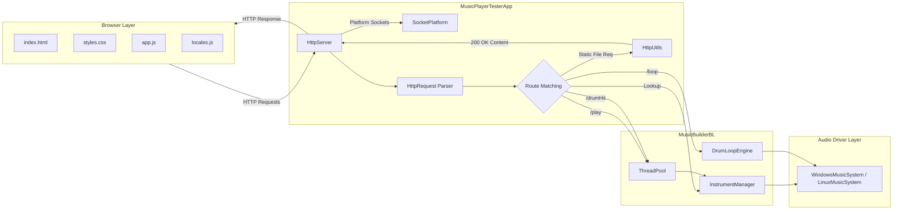

---

# Architecture & Design Document: MusicPlayerTesterApp

`MusicPlayerTesterApp` hosts the HTTP server and real-time dispatcher for the **Virtual 61-Key Synthesizer & Sargam Workstation**. It handles platform-independent socket communications, HTTP protocol decoding, static asset delivery, and multi-threaded audio task scheduling.

---

## 1. Class Architecture & Roles



### Class & Module Responsibilities

* **`SocketPlatform.h`**: Encapsulates OS differences between Windows (`winsock2.h`, `ws2_32.lib`) and Linux/POSIX (`<sys/socket.h>`, `<unistd.h>`). It standardizes the socket handle type as `socket_t` and provides cross-platform helpers like `CloseSocketHandle` and `PlatformUtils::OpenBrowser`.
* **`HttpServer`**: Manages the socket lifecycle. Handles bind, listen, client TCP connection acceptance, and TCP non-buffering (`TCP_NODELAY`). It delegates incoming payload interpretation to a functional `RequestHandler` callback.
* **`HttpRequest`**: Represents an HTTP 1.1 request line. Splits the incoming wire format into `method`, target `path`, trailing `query` parameters, and HTTP `version`.
* **`HttpRoutes.h`**: Central repository for routing identifiers, query parameter keys, HTTP methods, and default responses. Eliminates hardcoded magic strings from the application logic.
* **`HttpUtils`**: Provides utility routines including percent-encoding decoding (`UrlDecode`), query string extraction (`GetQueryParam`), MIME-type matching, asset path resolution across directory structures, and HTTP wire formatting (`MakeHttpResponse`).
* **`main.cpp` (Main Dispatcher)**: Entry point and controller. Boots the audio backend (`WindowsMusicSystem` or `LinuxMusicSystem`), binds domain services (`DrumKit`, `InstrumentManager`, `DrumLoopEngine`, `ThreadPool`), and translates HTTP actions into audio engine events.

---

## 2. Sequence Diagrams

### Melodic Note Playback (`GET /play?inst=Harmonium&freq=261.63&vol=0.8&dur=1.2`)



---

### Static Asset Delivery (`GET /styles.css`)



---

### Graceful System Shutdown (`POST /shutdown`)

```mermaid
sequenceDiagram
    autonumber
    actor User as UI Exit Button
    participant Server as HttpServer
    participant Main as Main (main.cpp)
    participant Loop as DrumLoopEngine
    participant Audio as WindowsMusicSystem

    User->>Server: POST /shutdown (or sendBeacon)
    Server->>Main: RequestHandler(rawBuffer, rawResponse)
    Main->>Main: HttpUtils::MakeHttpResponse("text/plain", "EXIT")
    Main-->>Server: return false (Signal shutdown)
    Server->>User: 200 OK (EXIT)
    Server->>Server: Close client socket & break accept loop
    Server-->>Main: Run() exits
    
    Main->>Loop: Stop()
    Main->>Server: Stop() & Cleanup()
    Main->>Audio: Clear()
    Note over Main: Server and audio subsystems release system hardware cleanly

```

---

## 3. Component Architecture & Data Flow

