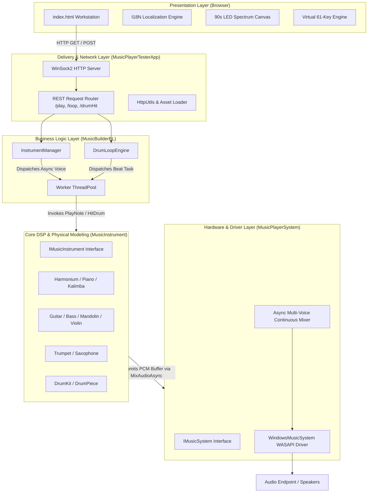

# 61-Key Virtual Synthesizer & Sargam Station (MusicPlayer SDK)

A multi-threaded C++ real-time audio synthesis engine and interactive Web UI workstation supporting Indian classical Sargam notations, Western modal systems, physical modeling synthesis, rhythm sequencing, and a retro 90s cassette-deck graphic equalizer.

---

## 🌟 Key Features

* **Real-Time Synthesis Engine:** Low-latency WASAPI / continuous multi-voice audio mixing pipeline.
* **Diverse Instrument DSP:** 
  * *Keyboard & Reeds:* Indian Harmonium, Grand Piano, 17-Key Kalimba.
  * *Plucked Strings:* Acoustic Guitar, Electric Bass Guitar, Mandolin (Dual-Course).
  * *Bowed Strings & Winds:* Acoustic Violin (Arco), Bb Brass Trumpet, Alto Saxophone.
* **Indian Classical & Western Music Theory:**
  * Support for major Indian Thaats (*Bilawal, Kafi, Bhairav, Yaman, Asavari, Khamaj, Bhairavi, Todi*).
  * Western modes (*Chromatic, Major/Minor Pentatonic, Blues*).
  * Native Sargam Saptak indicators (Mandra $\text{S}\d{a}$, Madhya $\text{Sa}$, Taar $\dot{\text{S}}\text{a}$).
* **90s Cassette Deck Graphic Equalizer:** 5-band gain adjustment (60 Hz, 250 Hz, 1 kHz, 4 kHz, 12 kHz) with real-time multi-color segmented LED spectrum analysis.
* **Multi-Language Internationalization (I18N):** Full UI and native script swara rendering for **English (US/UK/IN)**, **Kannada (ಕನ್ನಡ)**, **Bengali (বাংলা)**, **Hindi (हिन्दी)**, **Urdu (اردو)**, and **French (Français)**.
* **Percussion & Groove Engine:** 16-step funk beats, 4/4 rock grooves, metronomic pulses, and manual drum hit triggers (*Dha, Ta, Tin, Jhan*).

---

## 🎯 High-Level Use Cases

* **Interactive Sargam & Raga Practice:** Practice Indian classical vocal or instrumental exercises across various Thaats with visual Saptak markers and scale highlighting.
* **Multi-Notation Performance:** Play in real-time using either traditional Indian Sargam notations (*Sa, Re, Ga, Ma...*) or Western solfège/note names (*C, D, E, F...*).
* **Cross-Genre Groove Accompaniment:** Perform live melodies alongside multi-pattern backing drum sequences (*4/4 Rock, 16-Beat Funk, Teental Metronome*) with variable BPM controls.
* **Equalization & Acoustic Shaping:** Adjust real-time 5-band vintage audio filters with dynamic LED spectrum feedback.
* **Low-Latency Synthesis via QWERTY:** Trigger polyphonic voices and percussion pads directly from a computer keyboard without external MIDI hardware.

---

## 🏗️ Architecture Overview

---

## 🧩 Component Responsibilities

* **`MusicPlayerTesterApp` (Delivery & Server Layer):**
* Hosts the local HTTP server over Windows Sockets (`ws2_32`).
* Resolves and serves static web assets (`index.html`).
* Parses REST endpoint query parameters (`/play`, `/loop`, `/drumHit`, `/shutdown`).
* Manages graceful application startup and teardown lifecycle.

* **`MusicBuilderBL` (Business Logic Layer):**
* **`InstrumentManager`:** Instantiates, registers, and maps available melodic instruments by standard names and aliases.
* **`DrumLoopEngine`:** Coordinates rhythmic timing loops on dedicated background threads with granular sleep precision.
* **`ThreadPool`:** Provides thread-safe task queuing to decouple audio buffer generation from network request handling.

* **`MusicInstrument` (DSP & Physical Modeling Layer):**
* Implements `IMusicInstrument` algorithms for string harmonics, non-linear reed saturation, brass formant filters, and ADSR envelopes.
* Encapsulates physical parameters and articulation styles (e.g., *Arco* for Violin, muting for Brass, dual-course plucking for Mandolin).
* **`DrumKit`:** Synthesizes parametric membrane and metallic transient sounds (*Kick, Snare, Hi-Hat, Crash*).

* **`MusicPlayerSystem` (Audio Subsystem Layer):**
* Implements `IMusicSystem` wrapping the Windows Core Audio (WASAPI) real-time audio pipeline.
* Runs continuous multi-channel mixing, software clipping protection, and buffer queue management.

* **`index.html` (Frontend Workstation Layer):**
* Renders the interactive 61-key bed with dynamic QWERTY key mapping.
* Manages dynamic multi-script font rendering and I18N locale dictionaries (**English, Kannada, Bengali, Hindi, Urdu, French**).
* Visualizes the 90s stereo cassette deck graphic equalizer and audio spectrum using HTML5 Canvas.
