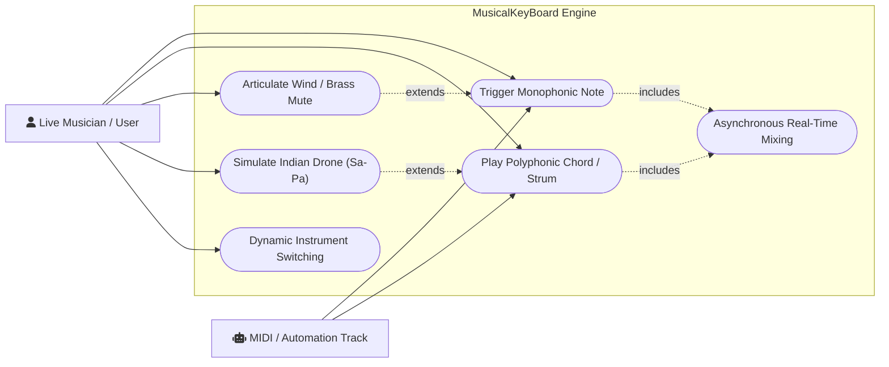
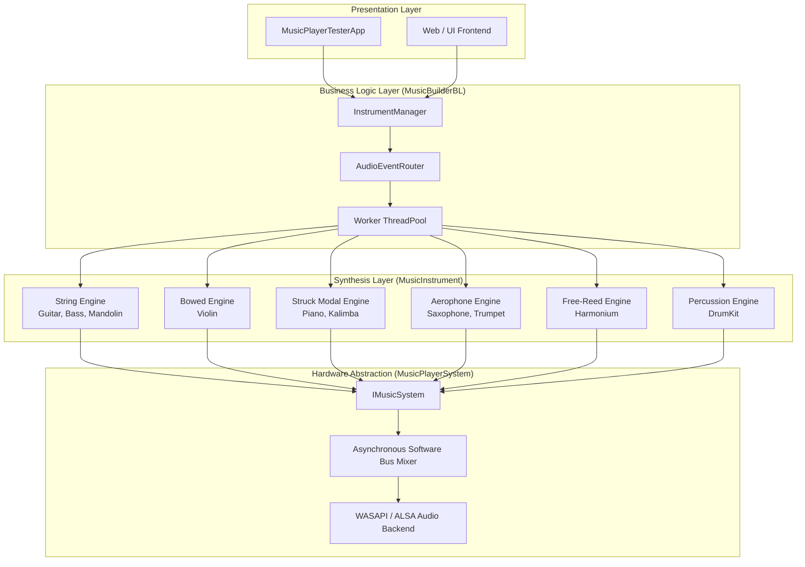
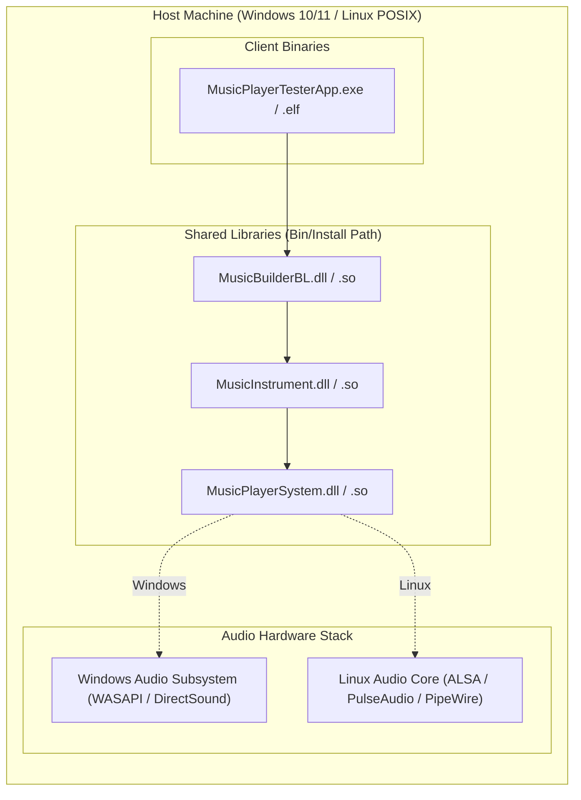
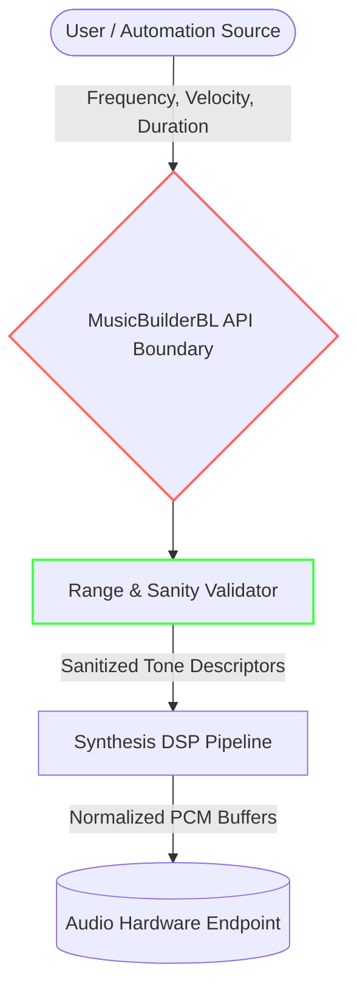
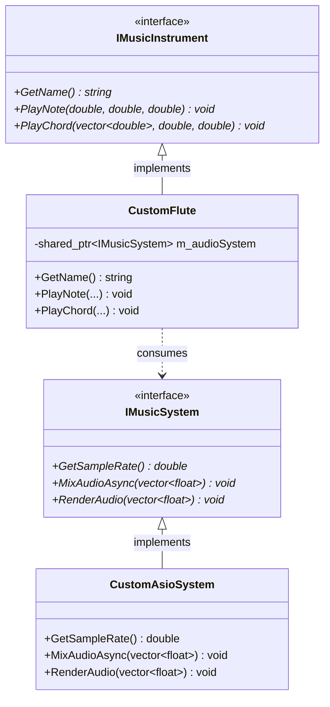

# Software Architecture Document (SAD): MusicalKeyBoard System

**Document Version**: 1.0.0  
**Status**: Approved / Implemented  
**Date**: 03-Sep-2026  
**Author**: Soumyajit Chatterjee  
**Target Subsystems**: `MusicPlayerSystem`, `MusicInstrument`, `MusicBuilderBL`, `MusicPlayerTesterApp`, `web`

---

## Contents

1. [Architectural Goals & Principles](#1-architectural-goals--principles)
2. [Use Case Scenarios](#2-use-case-scenarios)
3. [Requirement View](#3-requirement-view)
4. [Conceptual View](#4-conceptual-view)
   - [Architectural Decisions & Technology Choices](#architectural-decisions--technology-choices)
   - [Architectural Risks & Mitigations](#architectural-risks--mitigations)
   - [Conceptual Architecture Diagram](#conceptual-architecture-diagram)
   - [Functional Breakdown of Architecture](#functional-breakdown-of-architecture)
   - [Critical Non-Functional Requirements (NFRs)](#critical-non-functional-requirements-nfrs)
5. [Deployment View](#5-deployment-view)
   - [Deployment Diagram](#deployment-diagram)
   - [Target OS Specifications: Windows vs. Linux](#target-os-specifications-windows-vs-linux)
   - [Prerequisites & Toolchain Setup](#prerequisites--toolchain-setup)
6. [Concurrency View](#6-concurrency-view)
   - [Thread Model & Synchronization](#thread-model--synchronization)
   - [Runtime Lifecycle & Lock-Free Queue Dynamics](#runtime-lifecycle--lock-free-queue-dynamics)
7. [Security View](#7-security-view)
   - [Data Flow Diagram (DFD)](#data-flow-diagram-dfd)
   - [Minimal Threat Model (STRIDE)](#minimal-threat-model-stride)
8. [Testability View](#8-testability-view)
9. [Third-Party Implementation Guide](#10-3rd_Party_Integration)
10. [Architectural Synthesis, Known Issues & Scope for Improvement](#10-Conclusion)

---

## 1. Architectural Goals & Principles

* **Zero-Sample Physical Simulation**: Synthesize musical timbres entirely via digital signal processing (Karplus-Strong waveguides, Euler-Bernoulli beam modals, and additive Fourier banks) without static WAV/SF2 sample dependencies.
* **Non-Blocking Execution Paths**: Ensure UI input dispatch and hardware rendering occur on isolated execution contexts to prevent audio underruns or buffer starvation.
* **Strict Layered Decoupling**: Isolate core audio rendering (`MusicPlayerSystem`), acoustic synthesis models (`MusicInstrument`), and business orchestration (`MusicBuilderBL`).
* **Cross-Platform Portability**: Enable portable compilation under modern C++17/20 across Windows (MSVC/MinGW-w64 UCRT64) and POSIX/Linux (GCC/Clang, ALSA/PulseAudio/JACK).

---

## 2. Use Case Scenarios



* **UC-01: Monophonic Pitch Articulation**: Real-time triggering of single pitches with velocity scaling and continuous decay.
* **UC-02: Humanized Chord Strumming**: Staggered string plucking across microsecond sweep intervals with polyphonic normalization.
* **UC-03: Aerophone Acoustic Filtering**: Dynamic insertion of Straight, Cup, or Harmon mutes on brass instruments altering radiation impedance in real time.
* **UC-04: Traditional Modal Drone Voicing**: Sustained generation of coupled fundamental and fifth harmonics (Sa-Pa) with bellows airflow fluctuation.
* **UC-05: Real-Time Dynamic Instrument Routing**: Hot-swapping synthesized instruments on active audio channels without pipeline reinitialization.

---

## 3. Requirement View

| Requirement ID | Category | Description | Source Module |
| --- | --- | --- | --- |
| **REQ-F-001** | Functional | Support 10 distinct physical-modeling instrument models. | `MusicInstrument` |
| **REQ-F-002** | Functional | Provide asynchronous master audio mixing (`MixAudioAsync`). | `MusicPlayerSystem` |
| **REQ-F-003** | Functional | Implement staccato tonguing, tremolo picking, and pizzicato models. | `MusicInstrument` |
| **REQ-F-004** | Functional | Expose lifecycle factory abstraction (`InstrumentManager`). | `MusicBuilderBL` |
| **REQ-NF-001** | Latency | End-to-end trigger-to-sound rendering latency must remain $< 20\text{ ms}$. | System-wide |
| **REQ-NF-002** | Headroom | Audio clipping must be prevented via non-linear soft limiters (`tanh`). | `MusicInstrument` |
| **REQ-NF-003** | Portability | System must link cleanly with both GCC (MinGW UCRT64) and Clang. | Build System |

---

## 4. Conceptual View

### Architectural Decisions & Technology Choices

* **C++17 Standard Core**: Selected to balance modern language safety (type-safe standard libraries, fold expressions, structured bindings) with toolchain support across Windows and Linux.
* **Decoupled Asynchronous Audio Model**: Synthesis engines allocate local stack/heap vectors and push them to `IMusicSystem::MixAudioAsync`. The instrument never stalls waiting for hardware audio endpoints to consume frames.
* **Pure Physical Modeling vs. Sample Tables**: Eliminated sample libraries to achieve low memory consumption, smooth pitch bends, zero disk I/O latency, and infinite dynamic velocity transitions.
* **Tanh Soft Limiting**: Employed `std::tanh` saturation across all summing points, avoiding digital hard-clipping when polyphonic voices sum above 0 dBFS.

### Architectural Risks & Mitigations

* **Risk 1: High CPU Load during Polyphonic Voice Bursts**
*Mitigation*: Modal partial generation drops partials above the Nyquist guard ($0.45 \cdot F_s$). Loops are organized in contiguous memory for compiler autovectorization.
* **Risk 2: Timing Jitter from Thread Sleep Articulations**
*Mitigation*: Keep tonguing and fanfare sequences contained within background asynchronous jobs, with non-blocking sample offset scheduling planned for subsequent revisions.
* **Risk 3: Unaligned Interface Contracts**
*Mitigation*: Strict abstract interface boundaries (`IMusicInstrument`, `IWindInstrument`, `IStringInstrument`) with export macros (`MI_API`) to ensure binary compatibility.

### Conceptual Architecture Diagram



### Functional Breakdown of Architecture

* **`MusicPlayerSystem`**: Hardware-facing sound abstraction. Initializes real-time PCM ring buffers, queries hardware sample rates, and coordinates audio card endpoint playback.
* **`MusicInstrument`**: Core mathematics and acoustics library. Implements wave propagation, string reflection filters, beam modal vibrations, brass lip non-linearities, and drum impact equations.
* **`MusicBuilderBL`**: Composition and orchestration engine. Encapsulates `InstrumentManager`, routes multi-track pitch assignments, and coordinates multi-threaded sound generation.
* **`MusicPlayerTesterApp`**: Console-based operational validation harness verifying end-to-end integration and acoustic fidelity.

### Critical Non-Functional Requirements (NFRs)

* **Real-time Determinism**: Signal rendering runs without thread contention or blocking calls on the master audio loop.
* **Memory Footprint**: Working set memory stays $< 32\text{ MB}$ due to procedural math and minimal audio frame buffering.
* **Audio Fidelity**: 32-bit floating-point internal bus processing with Nyquist cutoffs ($0.45 \cdot F_s$) prevents high-frequency harmonic foldover.

---

## 5. Deployment View

### Deployment Diagram



### Target OS Specifications: Windows vs. Linux

* **Windows Target**:
* Output: Dynamic link libraries (`MusicInstrument.dll`, `MusicPlayerSystem.dll`, `MusicBuilderBL.dll`).
* Backend: WASAPI (Windows Audio Session API) operating in shared low-latency or event-driven streaming mode.
* Runtime Dependency: UCRT runtime (`ucrtbase.dll`), MinGW/GCC 16.x or MSVC 2022 CRT.


* **Linux Target**:
* Output: Shared objects (`libMusicInstrument.so`, `libMusicPlayerSystem.so`, `libMusicBuilderBL.so`).
* Backend: ALSA (`libasound.so`) or PulseAudio/PipeWire sink.
* Linker Flags: `-fPIC`, `-pthread`, `-lasound`, `-lm`.


### Prerequisites & Toolchain Setup

* **Build System**: CMake 3.20+ with Ninja build engine.
* **Compilers**: GCC 13+/16+ (MinGW-w64 UCRT64) or Clang 16+ or MSVC v143+.
* **PowerShell Automation**: `build_and_install.ps1` for automated configuration, compilation, and shared library staging.
* **Shell Automation**: `build_and_install.sh` for POSIX systems.

---

## 6. Concurrency View

### Thread Model & Runtime

```
[Thread 1: UI / Main Client Thread]
   │
   ├─► Event dispatch: InstrumentManager::GetInstrument("Violin")->PlayNote(...)
   └─► Non-blocking return

[Thread Pool: MusicBuilderBL Worker Threads]
   │
   ├─► Computes DSP math (Karplus-Strong, Additive Partials)
   ├─► Allocates local vector<float> outputBuffer
   └─► MixAudioAsync(outputBuffer)

[Thread 3: MusicPlayerSystem Asynchronous Audio Queue Thread]
   │
   ├─► Consumer loop: Pops PCM vectors from lock-free ring buffer
   ├─► Sums channels into master mixing accumulator
   └─► Signals audio hardware client buffers

[Thread 4: High-Priority OS Audio Hardware Thread (WASAPI / ALSA)]
   │
   └─► Pulls ready mixed PCM frames to sound card DMA buffer (Strict 10ms deadline)

```

### Runtime Lifecycle & Lock-Free Queue Dynamics

* **Job Isolation**: Audio synthesis jobs run on short-lived worker threads or within the context of the caller, keeping the primary playback thread free from heavy computations.
* **Buffer Handoff**: Completed PCM blocks pass through `MixAudioAsync` using move-semantics into an internal double-buffered concurrent queue.
* **Zero Contention**: The audio thread does not allocate heap memory or execute thread synchronization primitives while running inside the hardware audio buffer pump.

---

## 7. Security View

### Data Flow Diagram (DFD)



### Minimal Threat Model (STRIDE)

| Threat Category | Target | Vector / Vulnerability | Mitigation Strategy |
| --- | --- | --- | --- |
| **Denial of Service (DoS)** | Synthesis DSP | Massive chord vector triggers or extreme duration values allocating gigabytes of RAM. | Bound maximum duration ($< 30.0\text{ s}$), sanitize sample counts, and enforce vector size limits. |
| **Denial of Service (DoS)** | Audio Engine | Passing $f_0 \le 0$ causing division by zero ($L = F_s / f_0$) or infinite loops. | Guard clauses across all instrument implementations: `if (freq <= 0.0) return;`. |
| **Elevation of Privilege** | Shared Libraries | DLL side-loading/hijacking via dynamic library searches. | Absolute search paths and signed DLL deployment practices for enterprise runtime environments. |
| **Tampering / Exploits** | Memory Safety | Out-of-bounds access in circular delay ring buffers ($n \ge \text{ringSize}$). | Enforce ring buffer access via modulo operations: `nextIdx = (idx + 1) % ringSize;`. |

---

## 8. Testability View

```
MusicalKeyBoard/
├── MusicInstrument/tests/
│   ├── Test_GuitarPhysicalModel.cpp     # Karplus-Strong waveguide decay verification
│   ├── Test_PianoInharmonicity.cpp       # Partial dispersion validation
│   ├── Test_HarmoniumChorus.cpp         # Detuned reed bank verification
│   ├── Test_WindMuteFilters.cpp         # Straight/Harmon frequency tilt tests
│   └── Test_SoftLimiterHeadroom.cpp     # Tanh soft-clipping boundary validation
└── MusicPlayerSystem/tests/
    ├── Test_AsynchronousMixer.cpp       # Lock-free queue and concurrent sum tests
    └── Test_SampleRateConversion.cpp    # Audio timing accuracy checks

```

* **Unit Verification (Deterministic Output)**: By initializing `std::mt19937` with static seeds, waveguide outputs generate bit-exact PCM buffers across runs, enabling regression tests via CRC32 or SHA-256 hash assertions.
* **Acoustic Energy Attenuation Verification**: Automated tests assert that signal energy decreases monotonically across decaying string and membrane rings:

$$\sum_{n=N_1}^{N_1+\Delta} y[n]^2 > \sum_{n=N_2}^{N_2+\Delta} y[n]^2 \quad \text{for } N_2 > N_1$$


* **Headroom Boundaries**: Polyphonic saturation checks confirm that multi-voice chords sum without exceeding $[-1.0, 1.0]$.

Here are the two sections to incorporate into `Architecture.md`, placed directly before the final conclusion and known issues section.

---

## 9. Extensibility SDK (Third-Party Integration)

The `MusicalKeyBoard` platform provides a native C++ Extensibility SDK that enables third-party developers, academic researchers, and sound designers to:

1. **Develop Custom Instrument Models**: Implement novel physical models (e.g., flutes, sitars, pipe organs, analog synth subtractive engines).
2. **Integrate Alternative Audio Backends**: Connect custom audio output systems (e.g., Linux ALSA/PulseAudio/JACK, macOS CoreAudio, ASIO low-latency drivers, or offline WAV disk renderers).

### SDK Public Export Surface

The SDK boundary is defined exclusively through header contracts with dynamic library export macros (`MI_API` and `MPS_API`):

```
install/
├── include/
│   ├── IMusicInstrument.h       # Base interface for melodic sound generators
│   ├── IStringInstrument.h      # Contract for plucked/bowed instruments
│   ├── IWindInstrument.h        # Contract for aerophone articulation & mutes
│   ├── IPercussionInstrument.h  # Contract for membrane & percussive instruments
│   ├── IMusicSystem.h          # Hardware playback & asynchronous mixer interface
│   └── MusicInstrumentExport.h  # DLL import/export symbol macro definitions
└── lib/
    ├── libMusicInstrument.dll.a (or .lib)
    └── libMusicPlayerSystem.dll.a (or .lib)

```

### Third-Party Extension Architecture




## 9. Third-Party Implementation Guide

### 9.1 Creating a Custom Instrument

To author an instrument, derive from `IMusicInstrument` (or a domain-specific interface like `IStringInstrument` or `IWindInstrument`), inject `std::shared_ptr<IMusicSystem>`, and implement the required pure virtual methods.

#### Step 1: Declare the Instrument Header (`CustomSitar.h`)

```cpp
#pragma once

#include "IMusicInstrument.h"
#include "IMusicSystem.h"
#include <memory>
#include <vector>
#include <string>

class CustomSitar : public IMusicInstrument 
{
private:
    std::shared_ptr<IMusicSystem> m_system;
    std::string m_name{"Custom Physical-Modeling Sitar"};

public:
    explicit CustomSitar(std::shared_ptr<IMusicSystem> system)
        : m_system(std::move(system)) {}

    ~CustomSitar() override = default;

    [[nodiscard]] std::string GetName() const override 
    {
        return m_name;
    }

    void PlayNote(double frequencyHz, double durationSeconds = 1.0, double velocity = 0.8) override;
    void PlayChord(const std::vector<double>& frequencies, double durationSeconds = 2.0, double velocity = 0.8) override;
};

```

#### Step 2: Implement the Physical Model (`CustomSitar.cpp`)

Synthesize samples into an output buffer, apply saturation, and hand the buffer off asynchronously:

```cpp
#include "CustomSitar.h"
#include <cmath>
#include <algorithm>

void CustomSitar::PlayNote(double frequencyHz, double durationSeconds, double velocity) 
{
    if (!m_system || frequencyHz <= 0.0 || durationSeconds <= 0.0) return;

    double sampleRate = m_system->GetSampleRate();
    size_t totalSamples = static_cast<size_t>(sampleRate * durationSeconds);
    std::vector<float> buffer(totalSamples, 0.0f);

    // Physical simulation loop (e.g., curved jawari bridge buzz modulation)
    double phase = 0.0;
    const double twoPi = 6.283185307179586;
    double phaseInc = (twoPi * frequencyHz) / sampleRate;

    for (size_t i = 0; i < totalSamples; ++i) 
    {
        double t = static_cast<double>(i) / sampleRate;
        double env = std::exp(-2.2 * t); // Pluck decay
        
        // Non-linear jawari bridge overtone dynamic
        double sample = std::sin(phase) + 0.3 * std::sin(2.0 * phase) * std::exp(-4.0 * t);
        phase += phaseInc;
        if (phase >= twoPi) phase -= twoPi;

        buffer[i] = static_cast<float>(sample * env * velocity);
    }

    // Dynamic headroom limiting
    for (float& s : buffer) 
    {
        s = std::tanh(s);
    }

    // Dispatch to hardware output
    m_system->MixAudioAsync(buffer);
}

void CustomSitar::PlayChord(const std::vector<double>& frequencies, double durationSeconds, double velocity) 
{
    for (double freq : frequencies) 
    {
        PlayNote(freq, durationSeconds, velocity / std::sqrt(static_cast<double>(frequencies.size())));
    }
}

```

---

### 9.2 Creating a Custom Audio System Backend

To route audio to an alternate sound card interface, custom driver engine, or disk file writer, implement `IMusicSystem`.

#### Step 1: Declare the Backend Class (`DiskWriterMusicSystem.h`)

```cpp
#pragma once

#include "IMusicSystem.h"
#include <vector>
#include <mutex>

class DiskWriterMusicSystem : public IMusicSystem 
{
private:
    double m_sampleRate;
    std::vector<float> m_masterTape;
    std::mutex m_mutex;

public:
    explicit DiskWriterMusicSystem(double sampleRate = 48000.0)
        : m_sampleRate(sampleRate) {}

    ~DiskWriterMusicSystem() override = default;

    [[nodiscard]] double GetSampleRate() const override 
    { 
        return m_sampleRate; 
    }

    void MixAudioAsync(const std::vector<float>& buffer) override 
    {
        std::lock_guard<std::mutex> lock(m_mutex);
        if (buffer.size() > m_masterTape.size()) 
        {
            m_masterTape.resize(buffer.size(), 0.0f);
        }
        for (size_t i = 0; i < buffer.size(); ++i) 
        {
            m_masterTape[i] += buffer[i];
        }
    }

    void RenderAudio(const std::vector<float>& buffer) override 
    {
        MixAudioAsync(buffer);
    }
};

```

---

### 9.3 Registering Custom Components in Client Applications

Third-party instruments integrate directly into the existing orchestration layer (`InstrumentManager` or consumer code) using standard polymorphic pointers:

```cpp
#include "InstrumentManager.h"
#include "CustomSitar.h"
#include "WindowsMusicSystem.h"

int main() 
{
    // 1. Initialize audio backend
    auto audioBackend = std::make_shared<WindowsMusicSystem>();

    // 2. Instantiate custom third-party instrument
    std::shared_ptr<IMusicInstrument> mySitar = std::make_shared<CustomSitar>(audioBackend);

    // 3. Play notes polymorphically
    mySitar->PlayNote(293.66, 3.0, 0.9); // Sound D4

    return 0;
}

```
---
### 9.4 Third-Party Developer Rules of Engagement

* **Dynamic Range Contract**: Implementations must normalize multi-voice accumulation using `std::tanh` or equivalent soft saturation before calling `MixAudioAsync` to maintain bus headroom without clipping.
* **Non-Blocking Guarantee**: The body of `PlayNote` or `PlayChord` should not perform synchronous thread sleeps (`std::this_thread::sleep_for`) on the calling thread. If temporal sequencing is needed, schedule frames via buffer index offsets.
* **Nyquist Adherence**: When synthesizing additive harmonic banks, stop harmonic generation before $0.45 \cdot F_s$ to eliminate aliasing foldover distortion.

## 10. Architectural Synthesis, Known Issues & Scope for Improvement

The `MusicalKeyBoard` system establishes a high-performance, sample-free synthesis foundation by cleanly decoupling physical modeling algorithms (`MusicInstrument`), asynchronous mixing hardware abstractions (`MusicPlayerSystem`), and business lifecycle orchestration (`MusicBuilderBL`). While this architecture ensures low-latency execution and zero memory bloat from audio sample libraries, several architectural trade-offs exist in the current implementation alongside clear paths for subsequent evolution.

### Known Architectural Limitations & Issues

* **Synchronous Articulation Latency on Dispatcher Threads**:
* Methods such as `Saxophone::Tonguing`, `Trumpet::Tonguing`, and `Mandolin::PlayTremolo` rely on loop-based sequences with blocking `std::this_thread::sleep_for` delays.
* When invoked directly on client or UI dispatch threads, this stalls event loops and introduces timing jitter proportional to the OS thread scheduler resolution.


* **Phase Coherence in High-Velocity Repetitions**:
* Procedural noise-based delay line initializers (Karplus-Strong engines in `Guitar`, `BassGuitar`, and `Violin`) re-seed pseudo-random generators (`std::mt19937`) with fixed constants.
* Rapid repeated strikes on the same pitch produce phase-identical attack transients, causing an unnatural "machine-gun" acoustic effect.


* **Pitch Discretization at High Frequencies**:
* String delay line lengths are truncated to integer sample boundaries ($L = \lfloor F_s / f_0 \rfloor$).
* At upper registers (e.g., above 1 kHz), the integer rounding causes microtonal tuning inaccuracies because the fractional pitch period cannot be accurately represented without fractional-delay all-pass filtering.


* **Sample Rate Hardcoding Fallbacks**:
* Several instrument synthesis loops fallback to an assumed default rate of 48000.0 Hz if the audio backend query is delayed or uninitialized, which can trigger audible pitch-shifting on 44.1 kHz, 88.2 kHz, or 96.0 kHz endpoints.


### Scope for Future Improvements

* **Sample-Accurate Event Timeline Scheduling**:
* Transition all sequential articulations (`Tonguing`, `PlayFanfare`, and `Strum` offsets) from thread sleeps to a timeline event queue inside `MusicBuilderBL`.
* Render entire multi-stroke phrases into a single time-offset PCM buffer before handing off to `MixAudioAsync`.


* **Fractional Delay All-Pass Filtering**:
* Integrate first-order Thiran all-pass or Lagrange interpolation filters into Karplus-Strong waveguide feedback loops to allow fractional delay lengths ($L + \delta$), achieving exact concert tuning across all octaves.


* **SIMD Vectorization & DSP Acceleration**:
* Vectorize additive modal synthesis loops (harmonic banks for `Harmonium`, `Piano`, and `Trumpet`) using AVX2/AVX-512 and ARM NEON intrinsics to minimize CPU utilization during heavy polyphony.


* **Dynamic Phase Dithering & Jitter**:
* Implement randomized noise seeding combined with subtle attack-phase jitter to eliminate identical transient reproduction during fast repetitive plucking or bowing.


* **Cross-Platform Audio Backend Expansion**:
* Expand `MusicPlayerSystem` beyond Windows WASAPI to include native Linux PipeWire/ALSA and macOS CoreAudio driver sinks with identical `IMusicSystem` interface bindings.
